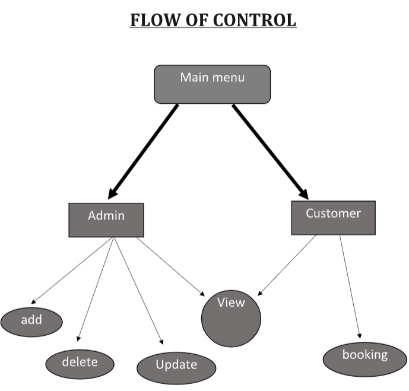
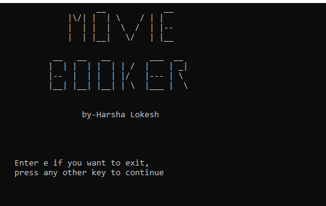
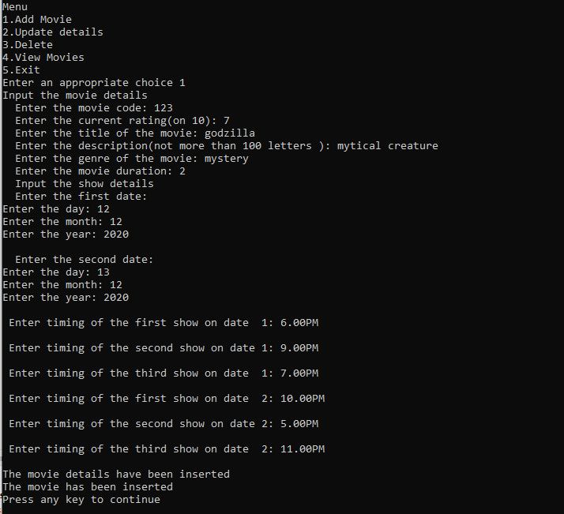
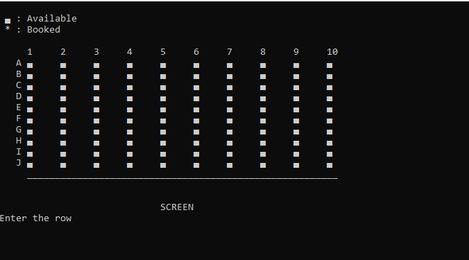

# Movie Booking application(e-commerce)

This project demonstrates the working of a movie e-booking website.
It allows password based entry to any administrator, who can add, delete and update the movie details.
The customers can surf through the currently showing movies and book them.

Project was originally developed for turbo C++,
 Few changes need to made for running in other compilers

## Concepts Implemented:

 File Handling

 Object Oriented Programming

 Structures

 Functions

## Flow of Control:

## Code Demo(Output):
Few images related to the project:-

Initial:

Admin: (Movie entry)

Booking: (seats)

These are sample pictures of the program, various features regarding the program can be seen after running.
